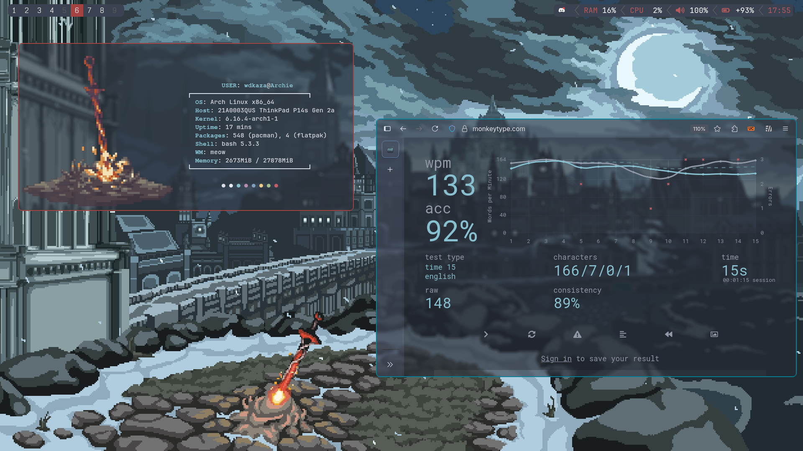
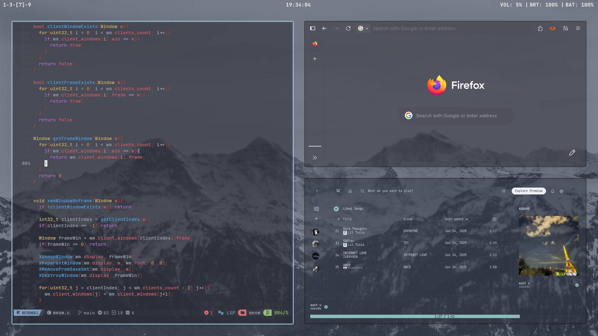
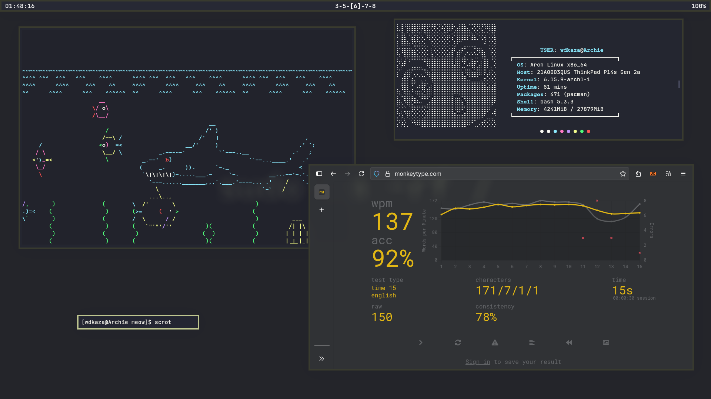
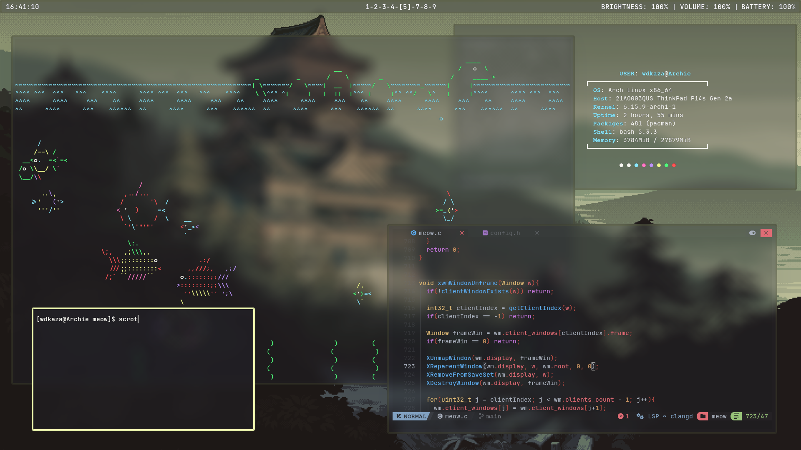
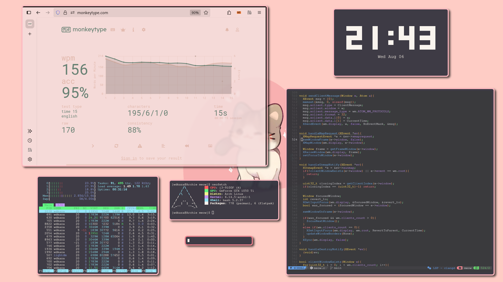

# meow
A very lightweight and minimal X window manager made in C, insipired by i3, Fluorite, dwm and ragnarWM. 
Minimal, no desktop bloat, no unnecessary features. Just clean.   
 
 
 
 
 
 
   
## Features 
So far meow has support for: 
- [x] Fullscreen 
- [x] Tiling layouts(just one currently) 
- [x] Window borders 
- [x] Gaps between windows in a layout 
- [x] Better config
- [x] Support for bars(example polybar, etc)(done but alot of tweaks left)
- [ ] More Layouts(cascade style, and 1 more fore sure)
- [ ] Cleaner readme(before release, with a proper installation guide for people who dont code(easy in other words))
- [ ] more/better EWMH support
- [ ] Hover to select windows(xD, i prefer alt+tab, dont like mouse so its low on priority) 
- [ ] Multiple monitors(either never or not soon at all)    

## Instalation
 

⚠️It still has alot of bugs i would like to fix them before providing a way to install it⚠️ 
For example if you close all windows on any desktop that is not "0" you will just lose control of the WM(not a bug anymore) 
But if you'd like to see this project get finished someday give it a star and i will try my best to finish it⭐

(but if you are really curious, you can run it with "startx ./meow", will provide a detailed guide a bit later when im sure meow is stable and is usable)
## Bugs

- [ ] (Priority bug)Killing bolybar will not readjust the config to account for no bar
- [ ] (Priority bug)Firefox pop-ups act weird, spawning at old locations
- [ ] Opening too many windows in cascade having small windowGap, masterGap will result in windows flying off screen
- [ ] Cascade code is way too messy xD, doesnt affect performance, etc but would be nice to clean it up heavily
- [ ] exitWM doesnt clean up memory, resulting in crashing the next session after a few minutes or so
- [x] Launching firefox(maybe any window) has a small chance to spawn a 0,0 ignoring the wm(temp fix : force quit with ctrl+q and it only happends on startup for me sometimes)
- [x] Opening a sub window? maybe thats what its called of a window, example in discord [add file] will not map it(thunar) correctly for some reason
- [ ] While polybar is focused(for whatever reason) if you try to fullscreen it, wm crashes
- [ ] Fullscreening should probably unmap other windows, looks weird with transparancy
- [ ] TODO. Will be adding more bugs that i encounter later, should have started keeping track of that earlier
