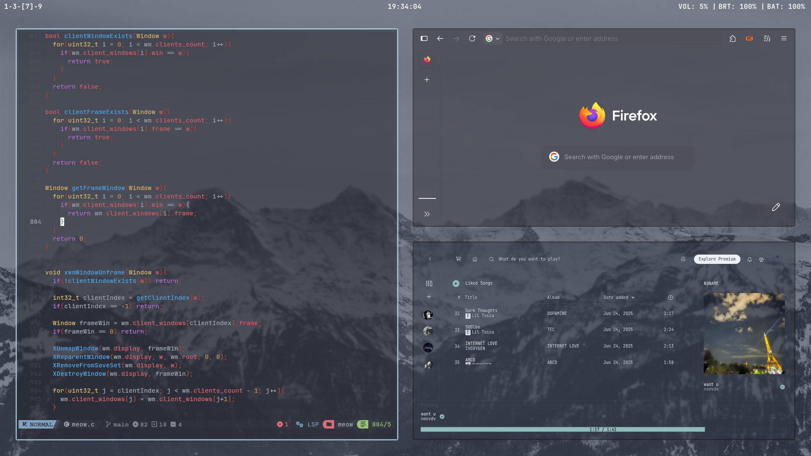
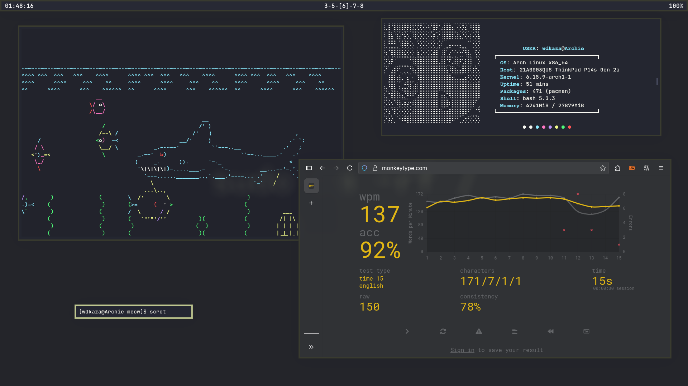
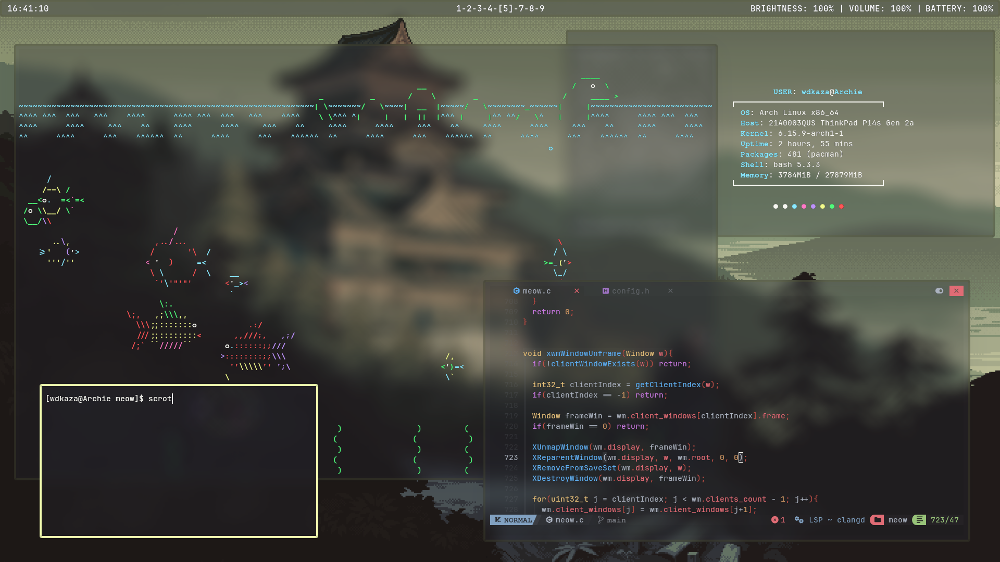
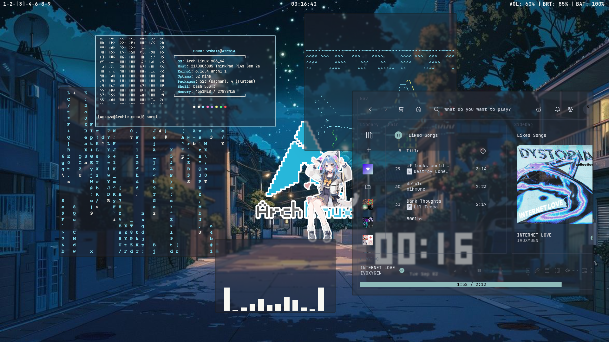
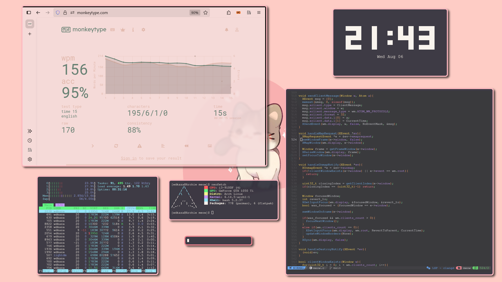

# Meow
A very lightweight and minimal X window manager made in C, insipired by i3, dwm and ragnarWM. 
Minimal, no desktop bloat, no unnecessary features. Just clean.   
 
 
 
 
 
   
## Features 
So far meow has support for: 
- [x] Fullscreen 
- [x] Tiling layouts(just one currently) 
- [x] Window borders 
- [x] Gaps between windows in a layout 
- [x] Better config
- [x] Built in bar(100% will get reworked or improved heavily, next(or maybe fuck the bar and EMWH support next, not sure, would be easier to allow other bars)) 
- [x] EWMH support
- [ ] Hover to select windows 
- [ ] Multiple monitors    

## Instalation
 

⚠️It still has alot of bugs i would like to fix them before providing a way to install it⚠️ 
For example if you close all windows on any desktop that is not "0" you will just lose control of the WM 
its an easy fix but there are alot of bugs i would like to fix and i want to add atleast a customizable bar before releasing meow 
But if you'd like to see this project get finished someday give it a star and i will try my best to finish it⭐

I want to mention github.com/cococry/ragnar as ragnar's old code helped me understand alot of things, 
Make sure to check it out aswell!  

## Bugs

- [ ] Launching firefox(maybe any window) has a small chance to spawn a 0,0 ignoring the wm(temp fix : force quit with ctrl+q and it only happends on startup for me sometimes)
- [ ] Firefox permission popup will sometimes spawn behind the window and firefox window needs to be focused to close it
- [ ] Anything related to EMWH may not work since its not supported yet
- [ ] TODO. Will be adding more bugs that i encounter later, should have started keeping track of that earlier
