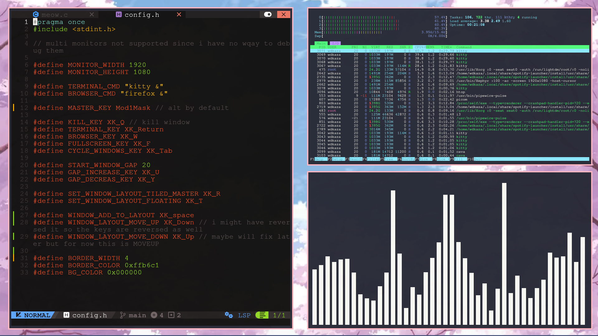

# meow
A very lightweight and minimal X window manager made in C, insipired by i3 and ragnarWM. 
Minimal, no desktop bloat, no unnecessary features. Just clean.  

So far meow has support for: 
- [x] Fullscreen 
- [x] Tiling layouts(just one currently) 
- [x] Window borders 
- [x] Gaps between windows in a layout 
- [ ] Built in bar 
- [ ] Hover to select windows 
- [ ] Multiple monitors    
  
  

## Instalation
 

⚠️It still has alot of bugs i would like to fix them before providing a way to install it⚠️ 
For example there is no way to reset the config, you need to relaunch the entire thing and thats a light one. 
But if you'd like to see this project get finished someday give it a star and i will try my best to finish it⭐

I want to mention github.com/cococry/ragnar as ragnar's old code helped me understand alot of things, 
Make sure to check it out aswell!  
