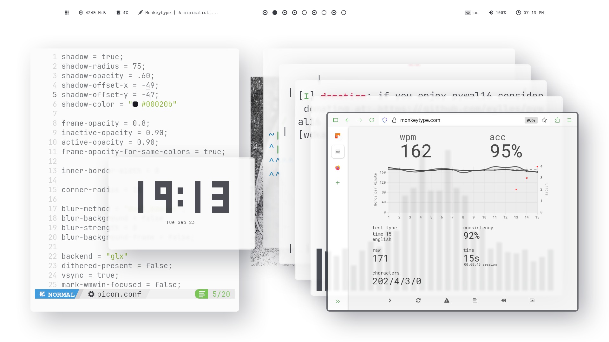
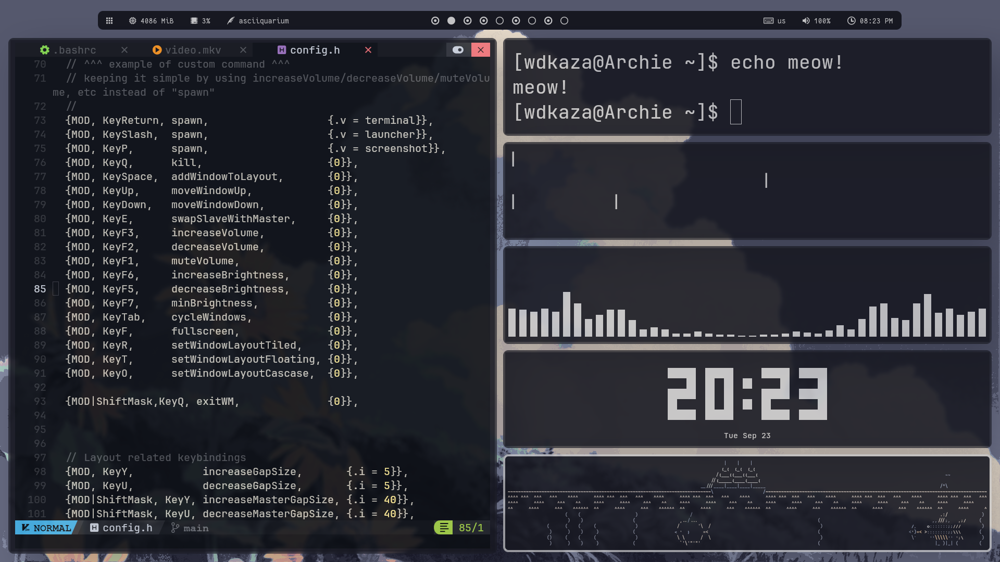

# meow
A very lightweight and minimal X window manager made in C, insipired by i3, Fluorite, dwm and ragnarWM. 
Minimal, no desktop bloat, no unnecessary features. Just clean.   
 
 
(more screenshots in screenshots folder)
 
## Features 

- [x] Fullscreen  
- [x] Multiple desktops  
- [x] Multiple tiling layouts  
- [x] Configurable gaps between windows in layouts  
- [x] Easy config  
- [x] Bars support  
- [x] layout IPC module for polybar
- [x] Some EWMH support  
- [x] Xrecourses (recompiling)
- [ ] 4 Corner resizing, and overall better feel for floating layout
- [ ] Hover with mouse to select windows  
- [ ] Multiple monitors  

# Instalation

Okay, so i had an installationg guide at some point but i quickly found out that  
the meow is still slightly far away from being stable to use, i couldnt launch steam it behaved weirdly  
shortly, ⚠️It still has alot of bugs i would like to fix them before providing a way to install it⚠️
But if you'd like to see this project get finished someday give it a star and i will try my best to finish it⭐

(small note for me for later) Turn off GPU accelerated rendering in web views for steam to work(will fix later)

## Bugs(not important category, some bugs are outdated)

- [ ] (Priority bug)Killing bolybar will not readjust the config to account for no bar
- [ ] (Priority bug)Firefox pop-ups act weird, spawning at old locations
- [ ] Something is broken with configureRequest, its fixed but new bugs appeared
- [ ] Xrecourses dont work until you recompile them manually once
- [x] Small visual issue with fixCascadeLayout function
- [ ] Opening too many windows in cascade/master having small windowGap, masterGap will result in windows flying off screen
- [ ] Cascade code is way too messy xD, doesnt affect performance, etc but would be nice to clean it up heavily
- [ ] exitWM doesnt clean up memory, resulting in crashing the next session after a few minutes or so
- [x] Launching firefox(maybe any window) has a small chance to spawn a 0,0 ignoring the wm(temp fix : force quit with ctrl+q and it only happends on startup for me sometimes)
- [x] Opening a sub window? maybe thats what its called of a window, example in discord [add file] will not map it(thunar) correctly for some reason
- [x] While polybar is focused(for whatever reason) if you try to fullscreen it, wm crashes
- [ ] Fullscreening should probably unmap other windows, looks weird with transparancy
- [ ] TODO. Will be adding more bugs that i encounter later, should have started keeping track of that earlier
