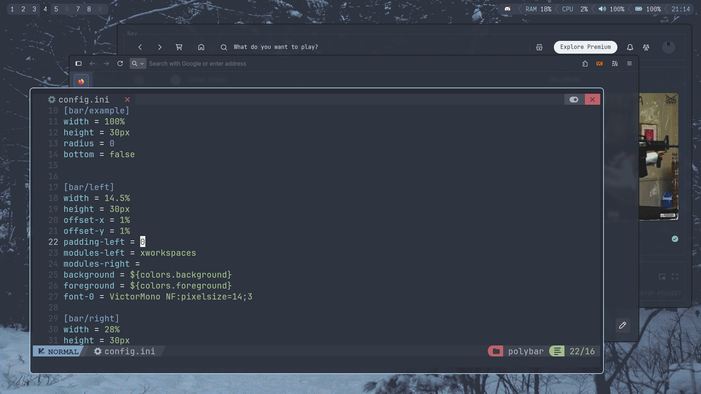

# meow
A very lightweight and minimal X window manager made in C, insipired by i3, Fluorite, dwm and ragnarWM.<br>
Minimal, no desktop bloat, no unnecessary features. Just clean.<br><br><br>
<br>
<br>
(more screenshots in screenshots folder, will add more here soon)
<br><br><br>
## Features<br>

- [x] Fullscreen  
- [x] Multiple desktops  
- [x] Multiple tiling layouts  
- [x] Configurable gaps between windows in layouts  
- [x] Easy config  
- [x] Bars support  
- [x] Some EWMH support  
- [ ] Hover with mouse to select windows  
- [ ] Multiple monitors  


# Instalation
 
## 1. Dependencies
 
Arch linux:  
``` sh
sudo pacman -S xorg xdotool libxft libxcomposite libxcursor libxrandr  
```
 
## 2. Building and installing
 
Modify the config-(config.h) to your liking, and after doing that run (with sudo if necessary)  
 
```sh
make install  
```
 
## 3. .xinitrc example, for autostart
 
```sh
nitrogen --restore  
polybar &  
picom &  
exec meow  
```

## General information

If you will encounter any bug or will have any questions feel free to add me at discord 'wdd.'  
Default keybinds are afwul, i would heavily recommend changing them to your own liking  
You can find more details about the confing inside config.h
(from Fluorite) If java apps are clunky, you can add 'export _JAVA_AWT_WM_NONREPARENTING=1' to your .xinitrc before meow execution   
also thanks for everyone who is supporting the mini project i decided todo, you are all making my day!⭐  

## Bugs(not important category, some bugs are outdated)

- [ ] (Priority bug)Killing bolybar will not readjust the config to account for no bar
- [ ] (Priority bug)Firefox pop-ups act weird, spawning at old locations
- [ ] Opening too many windows in cascade/master having small windowGap, masterGap will result in windows flying off screen
- [ ] Cascade code is way too messy xD, doesnt affect performance, etc but would be nice to clean it up heavily
- [ ] exitWM doesnt clean up memory, resulting in crashing the next session after a few minutes or so
- [x] Launching firefox(maybe any window) has a small chance to spawn a 0,0 ignoring the wm(temp fix : force quit with ctrl+q and it only happends on startup for me sometimes)
- [x] Opening a sub window? maybe thats what its called of a window, example in discord [add file] will not map it(thunar) correctly for some reason
- [ ] While polybar is focused(for whatever reason) if you try to fullscreen it, wm crashes
- [ ] Fullscreening should probably unmap other windows, looks weird with transparancy
- [ ] TODO. Will be adding more bugs that i encounter later, should have started keeping track of that earlier
